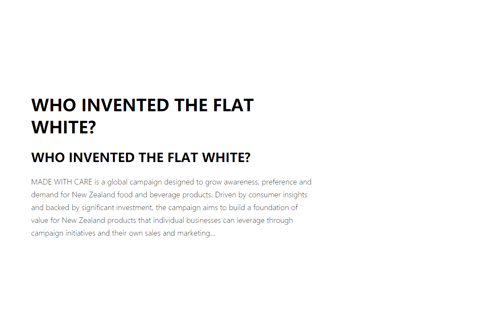

## Project Description
#### Mainly imitate a [website](https://www.nzstory.govt.nz/), learn its layout and design, the site is responsive, using Bootstrap 
#### Website theme:  Building a nation of storytellers.
## Project Operation
#### 1. download the files
#### 2. ' index.html ' open in chrome brower 
## Project Specific
#### - CSS Files ( index, public, theme )
##### theme.css 
```
body {
	--theme-color: #BFDEA0;
	/* use--> color: var(--theme-color); */
	--normal-size: .875rem;
	--my-transition: all .25s ease-in;
	--md-padding: 0 30px;
	--sm-padding: 0 40px;
}

h1,
h2,
h3,
h4,
h5,
p,
span,
small {
	margin: 0;
	padding: 0;
}
```
#### - Font Files

##### knockout ; gotham medium ; gotham book
#### - JS Files ( public)
#### - Html Files 
## Project Optimization
#### draw away from the public style, behavior
#### 
## Project Reference and Material
#### [Original website](https://www.nzstory.govt.nz/) 
#### [Svg to ico Converter](https://cloudconvert.com/svg-to-ico)
#### [colors](https://coolors.co/palettes/trending)
#### [Bootstrap Tutorials](https://www.runoob.com/bootstrap/bootstrap-tutorial.html	)
## Project Impression
#### 1.  I found the concept of modularity in css. I bring in the common css code from outside, and then the css of different pages is written on the head tag using internal stylesheets. It means I can write the same class name or ID name on different pages. This is similar to what I'm writing about node.
#### 2.  I solved a css problem. In general, margin-right is invalid, I do not know why there is such a problem, Baidu interpretation, standard document flow under the margin-right has no effect, need to add float. Like this:
```
.myResourceBox .right-img {
	width: 100%;
	float: right;
	margin-right: -18%;
}
```
#### 3. I like New Zealand very much.